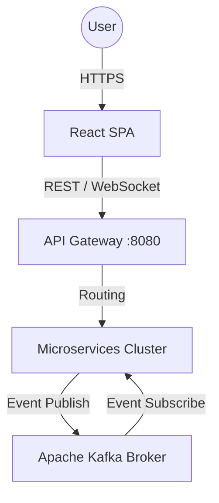
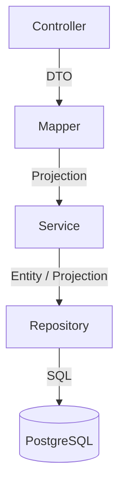

# 🏢 트위터 클론 MSA 마스터 아키텍처 (arc42 & C4 Model 기반)

본 문서는 엔터프라이즈 소프트웨어 아키텍처 표준인 **arc42 템플릿과 C4 모델**을 기반으로 작성된 트위터 클론 프로젝트의 최상위 설계도입니다.

---

## 1. 서론 및 목표 (Introduction & Goals)
* **목표:** 높은 트래픽을 견디는 트위터 클론의 백엔드(Spring Cloud MSA)와 프론트엔드(React SPA) 구현.
* **핵심 품질 속성(NFRs):** 서비스 간 완벽한 격리(Isolation), 비동기 이벤트를 통한 성능 최적화(Event-Driven), 코드 응집도 극대화.

---

## 2. 시스템 컨텍스트 및 컨테이너 (C4 Model - Context & Containers)

### 2.1. C4 System Context Diagram

### 2.2. 마이크로서비스 컨테이너 맵핑 (Container View)
14개의 마이크로서비스는 다음과 같은 역할을 수행합니다.
* **인프라:** `eureka-server`(디스커버리), `config-server`(설정), `api-gateway`(라우팅/JWT검증).
* **코어 도메인:** `user-service`(회원/인증), `tweet-service`(트윗/리트윗), `chat-service`(채팅).
* **특수 도메인:** 
  * `image-service`: DB 없이 AWS S3 연동만 수행.
  * `websocket-service`: STOMP/SockJS 기반 실시간 알림 브로드캐스팅.
  * `email-service`: Kafka 이벤트를 수신하여 메일 발송 전용 컨슈머.

---

## 3. 컴포넌트 아키텍처 (C4 Model - Component View)

백엔드 마이크로서비스 내부의 레이어 구조와 의존성 규칙입니다.

### 3.1. 백엔드 컴포넌트 제약 사항

* **Controller:** `@Valid` 검증, `HeaderResponse` 페이징 처리 전담. (`HeaderResponse`는 페이징이 필요한 첫 도메인 서비스인 Phase 5(tweet-core)에서 `commons`에 추가합니다 — 페이징할 대상이 없는 Phase에서 미리 만들지 않습니다.)
* **Mapper:** `MapStruct` 금지. `commons`의 `BasicMapper` 사용 강제.
* **Service:** `find` 대신 `get` 명명 규칙 사용. 읽기 전용 로직은 `@Transactional(readOnly=true)` 강제.
* **Repository:** `Native Query` 절대 금지. `Class<T> type`을 활용한 **동적 프로젝션(Dynamic Projection)** 강제.

### 3.2. 프론트엔드 컴포넌트 제약 사항
* **뷰-로직 분리:** 뷰 컴포넌트 안에서 `useSelector`, `useDispatch` 사용 금지. 반드시 `use{컴포넌트명}.ts` (Custom Hook)으로 로직을 분리.
* **비동기 사이드 이펙트:** `Redux Thunk` 금지. **Redux Saga(`sagas.ts`)**의 제너레이터 함수(`yield call`, `yield put`) 강제.
* **스타일링:** `styled-components` 금지. **Material-UI v4 (`makeStyles`)** 강제.

---

## 4. 횡단 관심사 (Cross-Cutting Concepts)

도메인과 무관하게 시스템 전체에 적용되는 기술적 정책입니다.

### 4.1. 보안 및 인증 (Security)
* **JwtProvider 위치:** `commons` 모듈에 `JwtProvider`(서명·만료 검증, subject/이메일 파싱)를 둡니다. `api-gateway`를 포함해 토큰을 다뤄야 하는 모든 서비스가 이 클래스를 공유합니다 — 서비스마다 JWT 파싱 로직을 따로 만들지 마십시오.
* **게이트웨이 인증 흐름(전체 그림):** ① `api-gateway`가 `JwtProvider`로 토큰 서명/만료만 우선 검증해 즉시 401 차단 여부를 결정 → ② 검증된 토큰의 이메일로 `user-service`를 동기 호출해 계정 활성화 여부를 확인 → ③ 활성 계정이면 요청 헤더에 `X-Auth-User-Id`를 주입해 하위 서비스로 전달, 하위 서비스는 이 헤더로 호출자를 식별(매번 JWT를 재파싱하지 않음).
  **[MUST NOT]** ②·③ 단계는 `user-service`(Phase 3)가 존재해야 의미가 있습니다. `user-service`가 아직 없는 Phase에서는 ①(서명/만료 검증 + 401 차단)까지만 구현하고, ②·③은 Phase 3 완료 직후 별도 통합 작업으로 이어 붙입니다 — 존재하지 않는 서비스를 향한 호출 코드를 미리 작성해두지 마십시오. Phase 3의 `user-service`는 `GET /api/v1/auth/user/{email}` 엔드포인트로 `{id, email, activationCode}`를 반환해야 이 통합이 가능합니다.
* **동기 통신 전파:** `@FeignClient` 호출 시 `commons` 모듈의 `FeignRequestInterceptor`가 자동으로 JWT 토큰을 다음 서비스로 릴레이.

### 4.2. 전역 예외 처리 (Exception Handling)
* **[MUST]** 비즈니스 예외 발생 시 `throw new ApiRequestException(...)`을 던집니다.
* `commons`의 `GlobalExceptionHandler`가 이를 캐치해 `ResponseEntity<String>`으로 변환합니다 — 본문은 `exception.getMessage()` 그대로, 상태 코드는 `exception.getStatus()`. **구조화된 JSON 에러 객체(status/message/timestamp 필드)로 감싸지 마십시오** — 단순 문자열 본문입니다. `try-catch`로 하드코딩된 응답을 만들지도 마십시오.

### 4.3. 전체 서비스 공통 빌드/인프라 컨벤션 (All Modules)
모든 마이크로서비스(도메인 서비스뿐 아니라 `eureka-server`, `config-server` 등 인프라 서비스 포함)에 예외 없이 적용됩니다.
* **[MUST] groupId / 패키지 구조:** 모든 모듈의 Maven `groupId`는 `com.wangyu`로 통일합니다(팀 자체 네임스페이스 — 원본 저자 개인 계정명을 그대로 베낄 필요 없음, groupId 자체는 설계 결정이 아니라 임의 식별자이므로 리뷰 시 원본과의 문자열 일치 여부를 채점 대상으로 삼지 않습니다). **Java 최상위 패키지는 항상 `com.wangyu`입니다** — 모듈/서비스 이름을 최상위 패키지에 접미사로 붙이지 마십시오(`com.wangyu.eurekaserver`, `com.wangyu.configserver`처럼 서비스명을 패키지에 반복하지 않습니다). 다만 이는 "서비스명 접미사 금지"이지 "하위 패키지 전면 금지"가 아닙니다 — 클래스 수가 늘어나는 모듈(`commons`처럼 예외/보안/매퍼 등 역할이 섞이는 경우)은 `com.wangyu.exception`, `com.wangyu.security`처럼 역할별 하위 패키지로 나눠도 됩니다. Controller/Service/Repository가 생기는 도메인 서비스(Phase 3+)는 레이어별 하위 패키지 구성이 자연스럽습니다.
* **[MUST] 호스트/포트 설정:** `application.yml`의 모든 호스트명은 하드코딩(`localhost`)하지 말고 환경변수 폴백 패턴을 사용합니다. 예: `${EUREKA_HOST:localhost}`, `${ZIPKIN_HOST:localhost}`. 컨테이너 배포 시 환경변수로 오버라이드하기 위함입니다.
* **[MUST] 분산 추적 (Zipkin):** 모든 서비스의 `application.yml`에 `spring.zipkin.base-url: http://${ZIPKIN_HOST:localhost}:9411`을 포함하고, `pom.xml`에 `micrometer-tracing-bridge-brave` 의존성을 추가합니다.
* **[MUST] 서비스 디스커버리 등록:** `eureka-server` 자신을 제외한 모든 서비스(인프라 서비스인 `config-server` 포함)는 `spring-cloud-starter-netflix-eureka-client`를 의존성에 포함하고 Eureka에 자신을 등록해야 합니다.
* Eureka 서버 자체의 `enable-self-preservation` 등 로컬 개발 편의를 위한 임의 튜닝 플래그는 원본에 없는 한 추가하지 마십시오 — 명시되지 않은 설정은 프레임워크 기본값을 그대로 둡니다.
* **[MUST] 공통 의존성은 루트 pom.xml에:** `spring-boot-starter-test`, `junit`(4.13.2) 등 모든 모듈이 공통으로 쓰는 의존성은 루트 `pom.xml`의 `<dependencies>`(상속되는 블록, `dependencyManagement` 아님)에 한 번만 선언합니다. 자식 모듈 `pom.xml`에 중복 선언하지 마십시오. `junit-vintage-engine`도 ADR-001(JUnit4 유지)을 위해 루트에 포함되어 있습니다 — Spring Boot 3.x의 `spring-boot-starter-test`는 기본적으로 JUnit5만 포함하므로 이 엔진 없이는 `org.junit.Test`가 아예 실행되지 않습니다.

---

## 5. 아키텍처 결정 기록 (Architecture Decision Records - ADR)

과거의 기술적 결정 사항과 그 배경(Why)입니다. 에이전트는 이를 절대적으로 준수해야 합니다.

* **ADR-001: 테스트 프레임워크 유지 (JUnit 4)**
  * **결정:** JUnit 5로 마이그레이션하지 않고 **JUnit 4(`org.junit.Test`)**를 유지한다.
  * **이유:** 기존 `AbstractServiceTest` 인프라(`@SpringBootTest`, `@MockBean`)와의 호환성 유지.
* **ADR-002: 데이터베이스 형상 관리 (Flyway)**
  * **결정:** JPA `ddl-auto: update`를 금지하고 `validate`로 고정하며, Flyway(`db/migration`)를 강제한다.
  * **이유:** MSA 환경에서 스키마 변경 추적 및 운영 데이터베이스 보호.
* **ADR-003: 지연 로딩 강제 (Lazy Loading)**
  * **결정:** 모든 연관관계(`@ManyToOne` 등)에 `fetch = FetchType.LAZY`를 강제하고 `@EntityGraph`로 N+1을 해결한다. 엔티티에 `@Data` 사용을 금지한다.
  * **이유:** EAGER 로딩과 `@Data`가 결합될 경우 잭슨 직렬화 시 무한 순환 참조(StackOverflow) 및 메모리 누수 발생.
