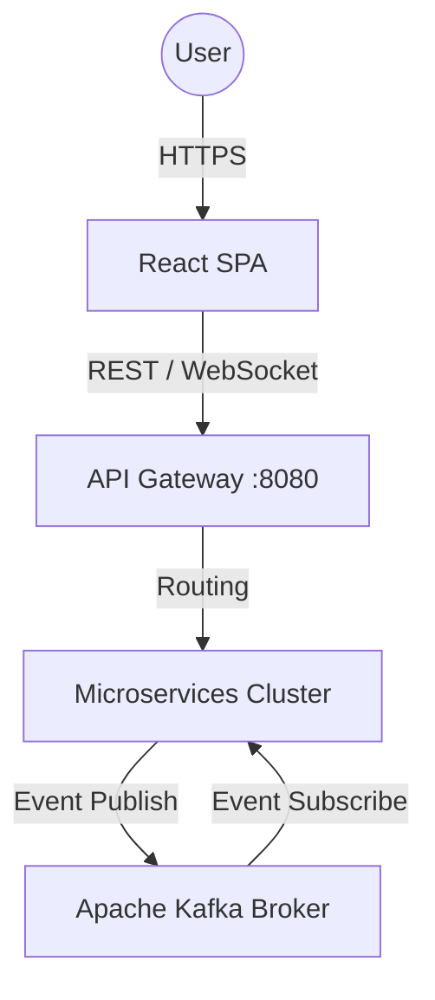
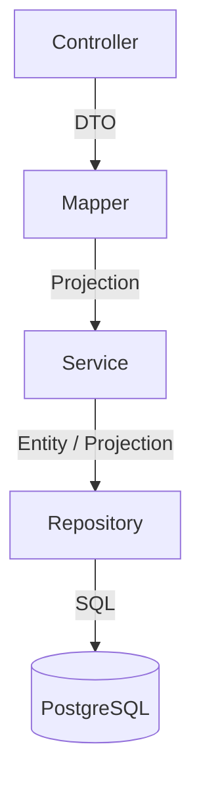

# 🏢 트위터 클론 MSA 마스터 아키텍처 (arc42 & C4 Model 기반)

본 문서는 엔터프라이즈 소프트웨어 아키텍처 표준인 **arc42 템플릿과 C4 모델**을 기반으로 작성된 트위터 클론 프로젝트의 최상위 설계도입니다.

---

## 1. 서론 및 목표 (Introduction & Goals)
* **목표:** 높은 트래픽을 견디는 트위터 클론의 백엔드(Spring Cloud MSA)와 프론트엔드(React SPA) 구현.
* **핵심 품질 속성(NFRs):** 서비스 간 완벽한 격리(Isolation), 비동기 이벤트를 통한 성능 최적화(Event-Driven), 코드 응집도 극대화.

---

## 2. 시스템 컨텍스트 및 컨테이너 (C4 Model - Context & Containers)

### 2.1. C4 System Context Diagram

### 2.2. 마이크로서비스 컨테이너 맵핑 (Container View)
14개의 마이크로서비스는 다음과 같은 역할을 수행합니다.
* **인프라:** `eureka-server`(디스커버리), `config-server`(설정), `api-gateway`(라우팅/JWT검증).
* **코어 도메인:** `user-service`(회원/인증), `tweet-service`(트윗/리트윗), `chat-service`(채팅).
* **특수 도메인:** 
  * `image-service`: DB 없이 AWS S3 연동만 수행.
  * `websocket-service`: STOMP/SockJS 기반 실시간 알림 브로드캐스팅.
  * `email-service`: Kafka 이벤트를 수신하여 메일 발송 전용 컨슈머.

---

## 3. 컴포넌트 아키텍처 (C4 Model - Component View)

백엔드 마이크로서비스 내부의 레이어 구조와 의존성 규칙입니다.

### 3.1. 백엔드 컴포넌트 제약 사항

* **Controller:** `@Valid` 검증, `HeaderResponse` 페이징 처리 전담.
* **Mapper:** `MapStruct` 금지. `commons`의 `BasicMapper` 사용 강제.
* **Service:** `find` 대신 `get` 명명 규칙 사용. 읽기 전용 로직은 `@Transactional(readOnly=true)` 강제.
* **Repository:** `Native Query` 절대 금지. `Class<T> type`을 활용한 **동적 프로젝션(Dynamic Projection)** 강제.

### 3.2. 프론트엔드 컴포넌트 제약 사항
* **뷰-로직 분리:** 뷰 컴포넌트 안에서 `useSelector`, `useDispatch` 사용 금지. 반드시 `use{컴포넌트명}.ts` (Custom Hook)으로 로직을 분리.
* **비동기 사이드 이펙트:** `Redux Thunk` 금지. **Redux Saga(`sagas.ts`)**의 제너레이터 함수(`yield call`, `yield put`) 강제.
* **스타일링:** `styled-components` 금지. **Material-UI v4 (`makeStyles`)** 강제.

---

## 4. 횡단 관심사 (Cross-Cutting Concepts)

도메인과 무관하게 시스템 전체에 적용되는 기술적 정책입니다.

### 4.1. 보안 및 인증 (Security)
* **JWT 흐름:** `api-gateway`에서 토큰 검증 -> `HttpServletRequest`를 통해 서비스로 전달 -> `JwtProvider`가 파싱하여 `UserPrincipal`로 SecurityContext에 바인딩.
* **동기 통신 전파:** `@FeignClient` 호출 시 `commons` 모듈의 `FeignRequestInterceptor`가 자동으로 JWT 토큰을 다음 서비스로 릴레이.

### 4.2. 전역 예외 처리 (Exception Handling)
* **[MUST]** 비즈니스 예외 발생 시 `throw new ApiRequestException(...)`을 던집니다.
* `commons`의 `GlobalExceptionHandler`가 이를 캐치하여 공통 JSON 스펙으로 변환합니다. `try-catch`로 하드코딩된 응답을 만들지 마십시오.

---

## 5. 아키텍처 결정 기록 (Architecture Decision Records - ADR)

과거의 기술적 결정 사항과 그 배경(Why)입니다. 에이전트는 이를 절대적으로 준수해야 합니다.

* **ADR-001: 테스트 프레임워크 유지 (JUnit 4)**
  * **결정:** JUnit 5로 마이그레이션하지 않고 **JUnit 4(`org.junit.Test`)**를 유지한다.
  * **이유:** 기존 `AbstractServiceTest` 인프라(`@SpringBootTest`, `@MockBean`)와의 호환성 유지.
* **ADR-002: 데이터베이스 형상 관리 (Flyway)**
  * **결정:** JPA `ddl-auto: update`를 금지하고 `validate`로 고정하며, Flyway(`db/migration`)를 강제한다.
  * **이유:** MSA 환경에서 스키마 변경 추적 및 운영 데이터베이스 보호.
* **ADR-003: 지연 로딩 강제 (Lazy Loading)**
  * **결정:** 모든 연관관계(`@ManyToOne` 등)에 `fetch = FetchType.LAZY`를 강제하고 `@EntityGraph`로 N+1을 해결한다. 엔티티에 `@Data` 사용을 금지한다.
  * **이유:** EAGER 로딩과 `@Data`가 결합될 경우 잭슨 직렬화 시 무한 순환 참조(StackOverflow) 및 메모리 누수 발생.
